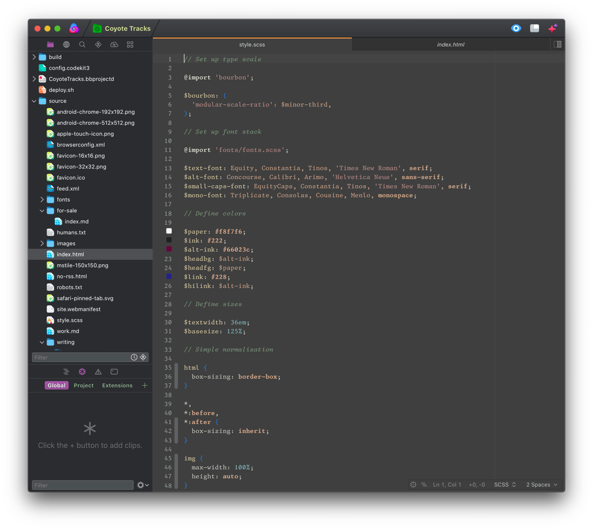

# Zenburn for Nova

Zenburn is a low-contrast color scheme. In the words of its original creator, "It's easy on your eyes and designed to keep you in the zone for long programming sessions."

The original Zenburn for Vim was created by Jani Nurminen.

- [The Official Zenburn Page](https://kippura.org/zenburnpage/)
- [Vim Zenburn on GitHub](https://github.com/jnurmine/Zenburn/)

This port was created by Watts Martin.

Homepage: https://github.com/chipotle/zenburn-nova

I've tried many other dark themes over the years, but I always come back to Zenburn. While this port tries to be faithful to the original color scheme, Nova and Vim have very different theming engines.

As with the original Zenburn, this port is licensed under GPL.
